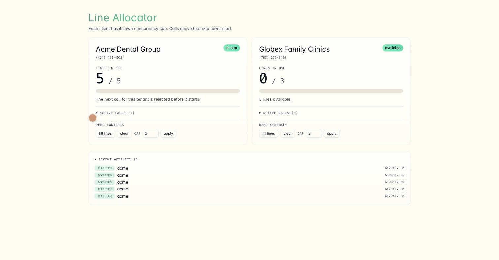

# Vapi concurrency gateway

Give every client you resell to their own limit on concurrent calls, so a spike
from one of them leaves everyone else's lines alone.

When you resell Vapi you buy concurrency as a pool, and by default your clients
share it on a first-come basis. Whoever dials first gets the lines. This is a
small service that sits in front of Vapi and hands each client a fixed slice of
what you bought.



Acme sits at its cap of five, so the call after that gets turned away before it
starts. A line frees up, and the next one goes through.

```text
inbound call  ->  Vapi assistant-request  ->  reserve a slot  ->  assistant, or reject
call ends     ->  Vapi status-update      ->  release the slot
outbound dial ->  POST /api/dial          ->  reserve a slot  ->  Vapi POST /call
```

## What happens to an over-cap call

The call never starts an assistant, so you pay for the carrier leg and nothing
else. No model or voice spins up. The caller hears whatever message that client
configured, and hangs up.

For inbound that is about all you can do. Someone is on the phone waiting to be
answered, so the call cannot wait its turn the way an outbound one can, and the
retry is them ringing back. Outbound is a list you work through, so it can be
paced, and Vapi's V2 campaigns already do that. You can set `maxConcurrency` on
a campaign (it defaults to 10, caps at 500, and cannot exceed your org limit),
and calls that will not fit are retried for up to an hour as capacity frees up.

Campaign pacing covers one list at a time, though. The budget belongs to the
campaign rather than the client, so two campaigns for the same client will run
at twice its slice, and neither of them can see inbound calls at all. Run both
and each side covers what the other cannot.

| | Handled by |
| --- | --- |
| Pacing one outbound list, with retries | A V2 campaign, `maxConcurrency` |
| One client's total across every campaign | This gateway |
| Inbound | This gateway |

## Inbound numbers have to be bare

Any number you want governed should have no assistant, squad, or workflow
attached to it directly. Vapi sends `assistant-request` when it needs someone to
pick the assistant, and a number that already has one never asks. The call
connects and the cap never gets consulted, with nothing to suggest anything is
off.

For each inbound number:

1. Remove its direct assistant, squad, or workflow assignment.
2. Point `server.url` at `https://your-service/vapi/webhook`.
3. Set `server.secret` to match your `WEBHOOK_SECRET`.
4. Map its Vapi phone-number ID to a tenant in `TENANTS_JSON`.

## Run it

You need Node 22 and a Postgres.

```bash
npm install
cp .env.example .env          # fill in DATABASE_URL, VAPI_API_KEY, WEBHOOK_SECRET, TENANTS_JSON
createdb vapi_concurrency
npm run migrate
npm run seed
npm run dev                   # http://localhost:3002
```

Node reads `.env` natively through `--env-file`, so there is no dotenv
dependency to install. The schema gets applied on startup and is idempotent, so
you can re-run it freely.

`npm test` wants a real Postgres, pointed at by `.env.test`. Use a throwaway
database, since the helper truncates every table between tests. Running against
a real database is deliberate, since the guarantee further down rests on how
Postgres row locking behaves under real contention.

## Deploying

This runs anywhere you can put a Node process next to a Postgres. There is
nothing platform-specific in the code and no platform SDK in the dependency
tree.

```bash
npm run build && npm start
```

We used Railway for the reference deployment because it was convenient, and Fly,
Render, ECS, Cloud Run, or a VM behind nginx all work the same way. Set the
environment variables, expose the port, and make sure `server.url` on your Vapi
numbers points at wherever it ends up.

Reservation state lives in Postgres rather than in process memory, so you can
run several instances behind a load balancer and the cap still holds across all
of them. The lock doing the work is a database row lock. Demo mode is the one
exception, since it keeps a timer in memory and expects a single instance.

## Environment

| Variable | Required | Purpose |
| --- | --- | --- |
| `DATABASE_URL` | Yes | Postgres connection string. |
| `WEBHOOK_SECRET` | Yes | Must equal the Vapi `server.secret`. |
| `TENANTS_JSON` | Yes, to seed | Your tenants, one line of JSON. |
| `VAPI_API_KEY` | For outbound | Private Vapi API key. |
| `PORT` | No | Defaults to `3002`. |
| `ENABLE_RECONCILIATION` | No | `true` turns on the missed-webhook safety net. |
| `DEMO_MODE` | No | `true` mounts the presenter controls. Keep it off in production. |

## Tenants

```json
[
  {
    "id": "client-a",
    "displayName": "Client A",
    "cap": 5,
    "phoneNumberIds": ["your-vapi-phone-number-id"],
    "assistantIds": ["your-vapi-assistant-id"],
    "voiceId": "Elliot"
  }
]
```

Drop that into `TENANTS_JSON` and run `npm run seed`, then run it again whenever
you change a cap or a mapping. Both ID fields take arrays, since a client may
own several numbers or assistants, and `assistantIds` only comes into play for
outbound.

Caps are enforced per tenant and there is no billing logic here, so keeping the
total at or under the concurrency you bought is on you.

## HTTP API

**`POST /api/dial`** starts an outbound call.

```json
{
  "tenantId": "client-a",
  "phoneNumberId": "your-vapi-phone-number-id",
  "assistantId": "one-of-that-tenant's-assistant-ids",
  "customerNumber": "+15551234567"
}
```

You get a `201` with a Vapi `callId`, or a `429` once that client is at its cap.
The route ships with no authentication of its own, on the assumption that you
already have an auth system and would rather wire in your own than work around
one we picked. Put yours in front of it before you expose it.

**`GET /api/state`** returns tenants, active slots, and recent events. It is
open so a static dashboard can render it.

**`POST /vapi/webhook`** receives `assistant-request` and `status-update` from
Vapi, guarded by `WEBHOOK_SECRET`.

## How the cap holds

`reserve` takes a `SELECT ... FOR UPDATE` row lock on the tenant, counts inside
that same transaction, and only inserts when there is room. Without the lock,
ten simultaneous calls all read the same count and all get admitted, which is
why there is a test that fails when you remove it.

One invariant is worth preserving if you change anything in here. A slot gets
released only on proof that a call ended, and never on the absence of proof. A
Vapi read coming back not-found tends to mean the call has not appeared yet
about as often as it means the call is over, so treating those two the same way
will free a line out from under a live conversation. Every release path is
written around that.

You can lower a cap below a tenant's current usage and nobody gets cut off. The
tenant drains instead, which falls out of the `used >= cap` check on its own.

## Where to read

1. `src/db/schema.sql`, the states a reservation moves through
2. `src/admission.ts`, the transaction that enforces the cap
3. `src/routes/webhook.ts`, where an inbound call meets it
4. `src/routes/dial.ts`, the outbound side

That covers the whole gateway. What is left is a dashboard, a seed script, and
the two optional modules below.

## Optional: reconciliation

Turned on with `ENABLE_RECONCILIATION=true`. Vapi's terminal `status-update` is
the normal way a slot gets released, and this background worker also polls held
calls and releases one when Vapi explicitly reports it as `ended`. It is there
to catch a dropped webhook, and the gateway works without it. Lives in
`src/optional/reconciler.ts`.

## Optional: demo mode

Turned on with `DEMO_MODE=true`, which is what the GIF above is running. It
gives you a way to fill a tenant's lines without dialling real phones, end those
calls one at a time, and change a cap from the dashboard.

None of it routes around the cap. Simulated calls go through the same `reserve`
the webhook uses, take the same lock, and get refused at the cap like anything
would. They carry a `sim_` ID, every statement in `src/demo/` is scoped to that
prefix, and the end-call route turns down an ID without it, so none of it can
reach a live call.

A filled tenant then cycles, holding at its cap for 25 seconds and leaving a
line free for 12 (`DEMO_HOLD_MS` and `DEMO_FREE_MS` if you want to change that).
The hold gets the longer half deliberately, since sitting at the cap is the part
worth explaining and the gap is where you place a real call to show it getting
through.

If you have two phones handy you can skip the simulation entirely. Set a
client's cap to 1 and call its number twice over. The first connects and the
second does not.

Deleting `src/demo/` and `src/routes/demo.ts` removes all of it, and nothing
else imports either one.

## License

MIT.
